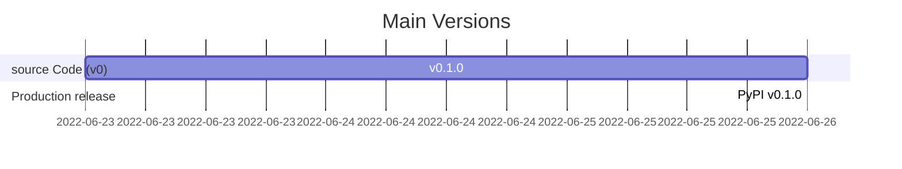

#  TensorFlow-GAN (TF-GAN)

[](https://docs.microsoft.com/en-us/windows/wsl/tutorials/gui-apps)
[](https://svgshare.com/i/ZhY.svg)[](https://github.com/ThomasByr/tf-gan/blob/master/LICENSE)
[](https://GitHub.com/ThomasByr/tf-gan/commit/)
[](https://gitHub.com/ThomasByr/tf-gan/commit/)
[](https://GitHub.com/ThomasByr/tf-gan/graphs/commit-activity)

[](https://github.com/ThomasByr/tf-gan)
[](https://github.com/ThomasByr)

1. [✏️ Setup](#️-setup)
2. [💁 More infos](#-more-infos)
3. [🧪 Testing](#-testing)
4. [⚖️ License](#️-license)
5. [🔄 Changelog](#-changelog)
6. [🐛 Bugs & TODO](#-bugs--todo)

## ✏️ Setup

You first need to build and compile the source code for your system (please replace `x` with the specific version numbers) :

```ps1
pip uninstall tf_gan -y
python setup.py sdist bdist_wheel
pip install .\dist\tf_gan-x.x.x-py3-none-any.whl
```

Then import the library as follow :

```py
import tf_gan as tfg
```

This hole program is supposed to run on `python>=3.10.4`.

## 💁 More infos

> Tensorflow `>=2` is compatible with NVidia GPUs and requires _almost_ no change in the code base (_not required_)

[This](https://www.tensorflow.org/install/gpu) is the page you are looking for. TL;DR :

- [450.80.02](https://www.nvidia.com/en-us/geforce/geforce-experience/) minimum graphics drivers
- [CUDA Toolkit](https://developer.nvidia.com/cuda-toolkit-archive)
- [NVIDIA cuDNN](https://developer.nvidia.com/cudnn) (please refer to [this guide](https://docs.nvidia.com/deeplearning/cudnn/install-guide/index.html#install-windows))

Then setup `PATH` variables, were `x` is the minor of the CUDA toolkit you have installed (make sure the paths are correct) :

```ps1
SET PATH=C:\Program Files\NVIDIA GPU Computing Toolkit\CUDA\v11.x\bin;%PATH%
SET PATH=C:\Program Files\NVIDIA GPU Computing Toolkit\CUDA\v11.x\extras\CUPTI\lib64;%PATH%
SET PATH=C:\Program Files\NVIDIA GPU Computing Toolkit\CUDA\v11.x\include;%PATH%
SET PATH=C:\tools\cuda\bin;%PATH%
```

Also make sure the [compute capability](https://docs.nvidia.com/cuda/cuda-c-programming-guide/index.html#compute-capabilities) of the GPU isn't slowing down the hole process due to the (non)atomicity of some operations. Furthermore, using GPU isn't going to be particularly helpfull with a small number of features to train (we have only 1027 features in total to train, which is a very small number). Benefits will increase as the number of features to train goes [past 4000](https://stackoverflow.com/questions/55749899/training-a-simple-model-in-tensorflow-gpu-slower-than-cpu) or so.

## 🧪 Testing

To begin, please make sure you have the necessary library up and ready on your environment :

```ps1
pip install -r .\requirements.txt
```

Then run a batch of tests with `unittest` with :

```ps1
python setup.py test
```

## ⚖️ License

This project is licensed under the GPL-3.0 new or revised license. Please read the [LICENSE](LICENSE) file.

Redistribution and use in source and binary forms, with or without modification, are permitted provided that the following conditions are met:

- Redistributions of source code must retain the above copyright notice, this list of conditions and the following disclaimer.
- Redistributions in binary form must reproduce the above copyright notice, this list of conditions and the following disclaimer in the documentation and/or other materials provided with the distribution.
- Neither the name of the tf-gan authors nor the names of its contributors may be used to endorse or promote products derived from this software without specific prior written permission.

THIS SOFTWARE IS PROVIDED BY THE COPYRIGHT HOLDERS AND CONTRIBUTORS "AS IS" AND ANY EXPRESS OR IMPLIED WARRANTIES, INCLUDING, BUT NOT LIMITED TO, THE IMPLIED WARRANTIES OF MERCHANTABILITY AND FITNESS FOR A PARTICULAR PURPOSE ARE DISCLAIMED. IN NO EVENT SHALL THE COPYRIGHT HOLDER OR CONTRIBUTORS BE LIABLE FOR ANY DIRECT, INDIRECT, INCIDENTAL, SPECIAL, EXEMPLARY, OR CONSEQUENTIAL DAMAGES (INCLUDING, BUT NOT LIMITED TO, PROCUREMENT OF SUBSTITUTE GOODS OR SERVICES; LOSS OF USE, DATA, OR PROFITS; OR BUSINESS INTERRUPTION) HOWEVER CAUSED AND ON ANY THEORY OF LIABILITY, WHETHER IN CONTRACT, STRICT LIABILITY, OR TORT (INCLUDING NEGLIGENCE OR OTHERWISE) ARISING IN ANY WAY OUT OF THE USE OF THIS SOFTWARE, EVEN IF ADVISED OF THE POSSIBILITY OF SUCH DAMAGE.

## 🔄 Changelog

To view the full history, please read the full [changelog](changelog.md). Latests changes :

<details>
    <summary>  Beta first minor release (click here to expand) </summary>

**v0.1.0** first release

- initial commit

</details>



## 🐛 Bugs & TODO

**bugs** (final correction patch version)

- deprecated packages in imported libs : to be removed in python 3.12 and pillow 10
- tensorflow warnings about deleted checkpoint with unrestored values when not saving final run as gif or not running the "interactive" mode

**todo** (first implementation version)

- [ ] provide examples, a lot of them
